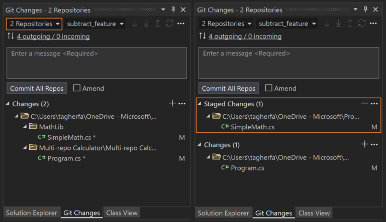
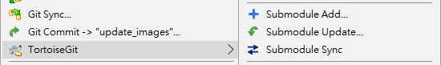
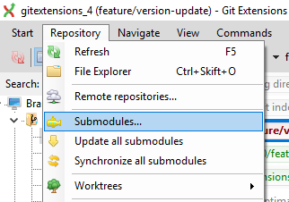
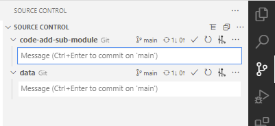
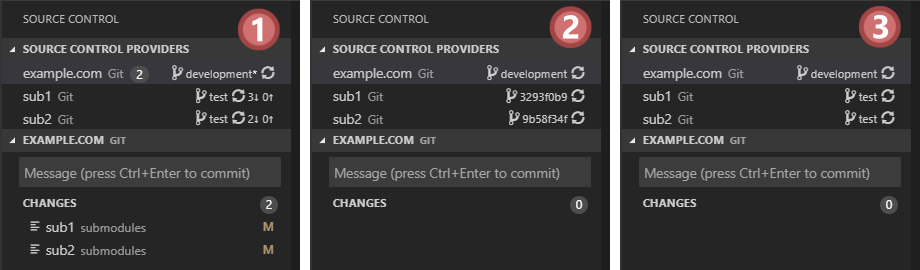

# Experiment the usage of sub-module in a personal space
- Presents some usefull links of Git `sub-module` best practices
- Contains scenarious of working with Git Submodules from command line (incorporated to [Makefile](Makefile))

# Support from UI

## Visual Studio
Does not directly support `Git-submodule` feature. It is possible to perform some basic scenarious by using `multi-repository` feature
    
**BUT** support for some of the important basic features is still msissing, namely
  1. Adding/removing Git `sub-modules`
  2. Initializing/updating/cloning Git `sub-modules`

More details can be found here:
1. [Git Submodules in Visual Studio ⋆ JonasR.app - the Trenches](https://jonasr.app/2020/04/vs-git-subm/)
1. [Introducing new Git features to Visual Studio 2022](https://devblogs.microsoft.com/visualstudio/introducing-new-git-features-to-visual-studio-2022/)
1. [Multi-repo Support in Visual Studio](https://devblogs.microsoft.com/visualstudio/multi-repo-support-in-visual-studio/)
## [TortoiseGit](https://tortoisegit.org/)

Has an extesive support on working with sub-modules. For more details read corresponding chapters at [Manual](https://tortoisegit.org/docs/tortoisegit/tgit-dug-submodules.html).

## [Git Extensions](https://git-extensions-documentation.readthedocs.io/en/release-3.4/index.html)

Has an extesive support on working with sub-modules. For more details read corresponding chapters at [documentation](https://git-extensions-documentation.readthedocs.io/en/release-3.4/submodules).

## [VS Code](https://code.visualstudio.com/)
- Support Git `sub-module` out of the box

    

- To get more flexibility a [Git (Submodule) Assistant](https://marketplace.visualstudio.com/items?itemName=ivanhofer.git-assistant) extension can be use

    

# Helpful links

## [Atlassian on Git Submodules](https://www.atlassian.com/git/tutorials/git-submodule)

1. [What is a git submodule?](https://www.atlassian.com/git/tutorials/git-submodule#:~:text=What%20is%20a%20git%20submodule%3F)
2. [When should you use a git submodule?](https://www.atlassian.com/git/tutorials/git-submodule#:~:text=When%20should%20you%20use%20a%20git%20submodule%3F)
   - _When you have a component that isn’t updated very often and you want to track it as a vendor dependency ..._
3. [Common commands for git submodules](https://www.atlassian.com/git/tutorials/git-submodule#:~:text=Common%20commands%20for%20git%20submodules)
   1. [Add git submodule](https://www.atlassian.com/git/tutorials/git-submodule#:~:text=for%20git%20submodules-,Add%20git%20submodule,-The)
   2. [Cloning git submodules](https://www.atlassian.com/git/tutorials/git-submodule#:~:text=Cloning%20git%20submodules)
   3. [Submodule workflows](https://www.atlassian.com/git/tutorials/git-submodule#:~:text=you%20are%20doing.-,Submodule%20workflows,-Once%20submodules%20are)
## [Book on Git Submodules](https://git-scm.com/book/en/v2/Git-Tools-Submodules)

1. [Starting with Submodules](https://git-scm.com/book/en/v2/Git-Tools-Submodules#:~:text=Starting%20with%20Submodules)
2. [Cloning a Project with Submodules](https://git-scm.com/book/en/v2/Git-Tools-Submodules#:~:text=Cloning%20a%20Project%20with%20Submodules)
3. [Working on a Project with Submodules](https://git-scm.com/book/en/v2/Git-Tools-Submodules#:~:text=Working%20on%20a%20Project%20with%20Submodules)
   1. [Pulling in Upstream Changes from the Submodule Remote](https://git-scm.com/book/en/v2/Git-Tools-Submodules#:~:text=Pulling%20in%20Upstream%20Changes%20from%20the%20Submodule%20Remote)
   2. [Pulling Upstream Changes from the Project Remote](https://git-scm.com/book/en/v2/Git-Tools-Submodules#:~:text=Pulling%20Upstream%20Changes%20from%20the%20Project%20Remote)
   3. [Working on a Submodule](https://git-scm.com/book/en/v2/Git-Tools-Submodules#:~:text=Working%20on%20a%20Submodule)
   4. [Publishing Submodule Changes](https://git-scm.com/book/en/v2/Git-Tools-Submodules#:~:text=Publishing%20Submodule%20Changes)
   5. [Merging Submodule Changes](https://git-scm.com/book/en/v2/Git-Tools-Submodules#:~:text=Merging%20Submodule%20Changes)
4. [Submodule Tips](https://git-scm.com/book/en/v2/Git-Tools-Submodules#:~:text=when%20you%E2%80%99re%20done.-,Submodule%20Tips,-There%20are%20a)
   1. [Submodule Foreach](https://git-scm.com/book/en/v2/Git-Tools-Submodules#:~:text=a%20little%20easier.-,Submodule%20Foreach,-There%20is%20a)
   2. [Useful Aliases](https://git-scm.com/book/en/v2/Git-Tools-Submodules#:~:text=may%20be%20useful.-,Useful%20Aliases,-You%20may%20want)
5. [Issues with Submodules](https://git-scm.com/book/en/v2/Git-Tools-Submodules#:~:text=Issues%20with%20Submodules)
   1. [Switching branches](https://git-scm.com/book/en/v2/Git-Tools-Submodules#:~:text=without%20hiccups%2C%20however.-,Switching%20branches,-For%20instance%2C%20switching)
   2. [Switching from subdirectories to submodules](https://git-scm.com/book/en/v2/Git-Tools-Submodules#:~:text=without%20hiccups%2C%20however.-,Switching%20branches,-For%20instance%2C%20switching)

# Build an experimatation sandbox
1. Clone this repository
1. Start a `Developer Command Prompt for VS ...` console
1. Navigate to this repository
1. Run `nmake` command
   - Local `code-origin` and `data-origin` Git repositories are produces
   - `data-origin` repository is mapped into `code-origin` as a `project/data` folder
2. Clone `code-origin` and play with it different scenarious mentioned below
